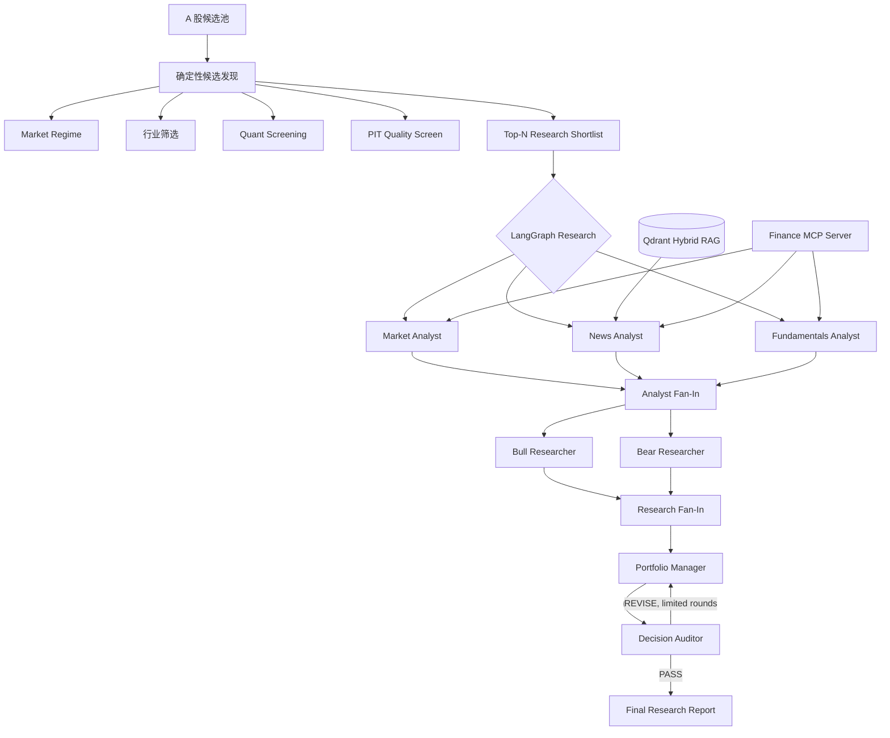

# A 股自动投研 Agent
### Multi-Agent A-Share Research & Candidate Discovery System

[](https://github.com/wyh22/multi-agent-trading/actions/workflows/ci.yml)


> 基于 [TauricResearch/TradingAgents](https://github.com/TauricResearch/TradingAgents) 二次开发的 A 股多智能体投研系统。  
> 项目聚焦 **候选发现 → 证据约束研究 → 多视角研判 → 独立审计**，不执行自动交易，不构成投资建议。

## 30 秒看懂这个项目

传统 LLM 股票分析容易遇到四类工程问题：**候选股票靠模型“猜”**、**历史研究混入未来数据**、**多 Agent 重复复述导致 Token/延迟膨胀**、**最终结论缺少独立校验**。

本项目针对这些问题做了系统化改造：

- 用确定性 Python 完成 **A 股候选发现与多因子筛选**，Agent 不直接“拍脑袋选股”；
- 用 **Point-in-Time（PIT）数据约束**限制历史时点可见信息，降低未来数据泄漏；
- 将原始多轮链路裁剪为 **7-Agent 并行 LangGraph**，分析师与 Bull/Bear 两阶段 Fan-Out/Fan-In；
- 增加 **Decision Auditor**，对最终结论做事实、数字、PIT 与证据一致性检查；
- 通过 **Finance MCP + Qdrant Hybrid RAG** 标准化工具与知识检索；
- 提供 **FastAPI + 浏览器 Chat UI + Docker Compose**，支持本地服务化运行。

## 核心能力

| 模块 | 实现 | 解决的问题 |
| --- | --- | --- |
| 7-Agent LangGraph | Market / News / Fundamentals → Bull & Bear → Portfolio Manager → Auditor | 减少重复角色与无效多轮辩论 |
| 并行执行 | Analyst Subgraph + Fan-Out/Fan-In | 降低串行 Agent 延迟 |
| A 股候选发现 | Market Regime + 行业筛选 + Quant Screen + PIT Quality Screen | 把数值筛选交给确定性算法 |
| PIT 数据治理 | 披露日/发布日期截止过滤 | 降低未来函数与历史穿越 |
| Decision Auditor | PASS / REVISE 条件路由 | 检查无依据推断和数字冲突 |
| Finance MCP | Streamable HTTP + Local fallback + allowlist | 解耦 Agent 与金融数据工具 |
| Hybrid RAG | Qdrant Dense + BM25 + RRF + 可选 Reranker | 为研究结论提供可追溯知识证据 |
| 多轮会话 | Router + thread_id + SQLite | 复用已审计研究上下文 |
| 服务化 | FastAPI / Chat UI / Docker Compose | 提升可复现性和演示效率 |
| 可观测性 | LangSmith Trace | 观察 LLM / Tool / Agent 调用链 |\n| Agent Evaluation | Tool / PIT / Trajectory / Report Quality | 将 Agent 工程质量变成可回归指标 |\n| Outcome Backtest | Rating vs. realized / benchmark return | 将“研究质量评估”和“市场结果评估”分离 |

## 系统架构



## 相比上游 TradingAgents，我做了什么

本仓库不是简单换数据源或改 Prompt，而是围绕 A 股投研场景重新做了一层工程化设计。

| 方向 | 上游框架基础 | 本仓库扩展 |
| --- | --- | --- |
| 研究对象 | 通用单股研究 | A 股数据适配 + 候选发现 |
| Agent 拓扑 | 多角色、多轮讨论 | 精简为 7-Agent，两阶段并行 |
| 候选发现 | 不是主要目标 | 确定性 Market / Sector / Quant / Quality Pipeline |
| 历史研究 | 依赖数据源行为 | 显式 PIT 截止规则与日期守卫 |
| 最终决策 | 研究链路汇总 | 独立 Decision Auditor，可触发修订 |
| 工具集成 | 本地工具为主 | MCP Server + Client fallback + 外部工具 allowlist |
| 知识检索 | 非核心 | Qdrant Dense + BM25 + RRF + PIT filter |
| 交互 | CLI 为主 | 多轮 Conversation Router + SQLite + Web Chat |
| 部署 | 本地执行 | FastAPI + Docker Compose |
| 验证 | 上游测试 | Agent / RAG / MCP / PIT / Conversation + Evaluation 回归测试 |

详细设计见 [docs/ENGINEERING_NOTES.md](docs/ENGINEERING_NOTES.md)。

## 快速开始

### 1. 本地 Python

推荐 Python 3.11 / 3.12。

```bash
git clone https://github.com/wyh22/multi-agent-trading.git
cd multi-agent-trading

python -m venv .venv
source .venv/bin/activate   # Windows: .venv\Scripts\activate

python -m pip install --upgrade pip
pip install -e ".[agent,dev]"

cp .env.example .env
```

至少配置一个可用 LLM Provider 的 API Key。其余 MCP、RAG、iFinD、LangSmith 能力都可以按需开启。

### 2. 数据源预检

```bash
python scripts/check_data_sources.py --ticker 601016
```

### 3. A 股候选发现

```bash
python scripts/discover_a_share.py \
  --mode all \
  --date 2026-08-20 \
  --sectors 4 \
  --per-sector 35 \
  --top 10
```

### 4. 单股深度研究

```bash
python -m cli.main analyze
```

### 5. FastAPI / Chat UI

```bash
uvicorn service.app:app --host 0.0.0.0 --port 8000
```

启动后：

- API 健康检查：`http://localhost:8000/health`
- Swagger：`http://localhost:8000/docs`
- 浏览器 Chat UI：`http://localhost:8000/ui/`

### 6. Docker Compose

```bash
cp .env.example .env
# 编辑 .env，填入真实的 LLM API Key
docker compose up --build
```

Compose 会启动：

- `agent-api:8000`
- `finance-mcp:8001`
- `qdrant:6333`

## API 示例

### 健康检查

```bash
curl http://localhost:8000/health
```

### 候选发现

```bash
curl -X POST http://localhost:8000/discover \
  -H "Content-Type: application/json" \
  -d '{
    "as_of_date": "2026-08-20",
    "sector_count": 4,
    "per_sector": 35,
    "top_n": 10,
    "strict_pit": true
  }'
```

### 多轮研究会话

```bash
curl -X POST http://localhost:8000/chat \
  -H "Content-Type: application/json" \
  -d '{
    "message": "深度分析 600519.SH，然后告诉我最大的风险是什么",
    "mode": "auto"
  }'
```

## 项目结构

```text
multi-agent-trading/
├── tradingagents/
│   ├── agents/          # Analysts / Researchers / Manager / Auditor
│   ├── graph/           # LangGraph、Subgraph、Fan-In/Fan-Out
│   ├── discovery/       # A 股候选发现与多因子筛选
│   ├── conversation/    # 多轮会话路由与状态
│   ├── mcp/             # Finance MCP Server / adapters
│   ├── rag/             # Qdrant Hybrid RAG
│   └── dataflows/       # 行情、财务、公告等数据适配
├── service/             # FastAPI + Web Chat UI
├── scripts/             # 数据预检、候选发现、RAG ingest、Chat CLI
├── tests/               # 回归测试
├── docs/                # 工程设计说明
├── Dockerfile
├── docker-compose.yml
└── pyproject.toml
```

## 验证与可复现性

本地构建环境记录的离线回归结果：

```text
55 passed, 1 skipped
```

详见 [V1.4_VALIDATION.md](V1.4_VALIDATION.md)。

同时仓库使用 GitHub Actions 在 Push / Pull Request 上自动执行：

```bash
python -m compileall -q tradingagents service scripts
pytest -q
docker build .
```

> 离线单元/回归测试通过，不等价于所有第三方在线服务已完成生产验证。真实 LLM、iFinD、外部 MCP、实时数据源仍依赖本地凭据与网络环境。

## 关键工程设计

### 为什么“筛选”不用 LLM

因子计算、日期判断、排序和配额属于确定性任务。让 LLM 直接负责这些环节既难验证，也容易产生幻觉。因此本项目把：

- 数值计算；
- PIT 日期守卫；
- 股票排序；
- 行业配额；
- 数据有效性检查；

尽量交给 Python。LLM 主要负责语义分析、工具选择、观点综合与审计。

### 为什么增加 Auditor

Portfolio Manager 负责形成最终观点，本身不适合作为自己的校验器。独立 Auditor 只检查：

- 事实与数字是否有上游证据；
- 是否出现截止日后的信息；
- 推断是否被写成事实；
- 评级是否与证据方向冲突；
- 是否存在前后数字不一致。

若发现实质问题，可通过 LangGraph 条件边触发有限次数修订。

### 为什么单独做 Agent Evaluation\n\n股票涨跌不能直接回答“Agent 工程是否可靠”。因此项目把两类评估拆开：\n\n- **Agent Evaluation**：工具是否选对、参数日期是否越界、轨迹是否符合预期、最终报告数字是否能在上游证据中找到；\n- **Outcome Backtest**：历史研究评级之后的实际收益、相对基准收益、方向命中率、回撤和 Sharpe。\n\n这样可以避免把偶然的市场结果误当成 Agent 架构质量，也避免只看单元测试而忽略最终输出。\n\n### 为什么要做 PIT-aware RAG

普通 RAG 只关注“相关不相关”，历史投研还必须回答“当时能不能看到”。因此检索同时约束：

```text
ticker == target
publish_date <= as_of_date
```

并在向量检索之后再次做日期防御性检查。

## 数据与安全边界

- 公开仓库不包含 `.env`、API Key、iFinD refresh token、LangSmith Key。
- iFinD 是可选 Adapter，不配置也可以使用其他数据链路。
- 历史选股仍可能受到历史成分数据完整性、停牌/退市样本和幸存者偏差影响。
- 候选发现结果是 Research Shortlist，不是收益承诺。
- 本项目不执行自动下单，不提供真实资金交易接口。

## 文档

- [ENGINEERING_NOTES.md](docs/ENGINEERING_NOTES.md)：设计取舍、代码所有权边界、面向工程评审的实现说明
- [FINAL_ARCHITECTURE.md](FINAL_ARCHITECTURE.md)：7-Agent、Subgraph、Fan-Out/Fan-In、Auditor
- [MCP_RAG_DOCKER_GUIDE.md](MCP_RAG_DOCKER_GUIDE.md)：MCP、Qdrant Hybrid RAG、Docker
- [V1.4_CONVERSATION_IFIND_GUIDE.md](V1.4_CONVERSATION_IFIND_GUIDE.md)：多轮会话与 iFinD Adapter
- [V1.4_VALIDATION.md](V1.4_VALIDATION.md)：当前离线验证边界

## 二次开发与许可证

本项目基于 [TauricResearch/TradingAgents](https://github.com/TauricResearch/TradingAgents) 二次开发。原项目采用 Apache License 2.0，本仓库保留原许可证，并在 [NOTICE](NOTICE) 中说明原始作者与二次开发范围。

如果你想快速理解“哪些是上游、哪些是本项目新增”，优先阅读：

1. `tradingagents/graph/setup.py`
2. `tradingagents/discovery/`
3. `tradingagents/agents/auditors/decision_auditor.py`
4. `tradingagents/mcp/`
5. `tradingagents/rag/`
6. `tradingagents/conversation/`
7. `tradingagents/evaluation/`\n8. `tradingagents/backtest/`\n9. `service/app.py`

---

**Research system, not an auto-trading bot. Evidence first, deterministic where possible, auditable by design.**
