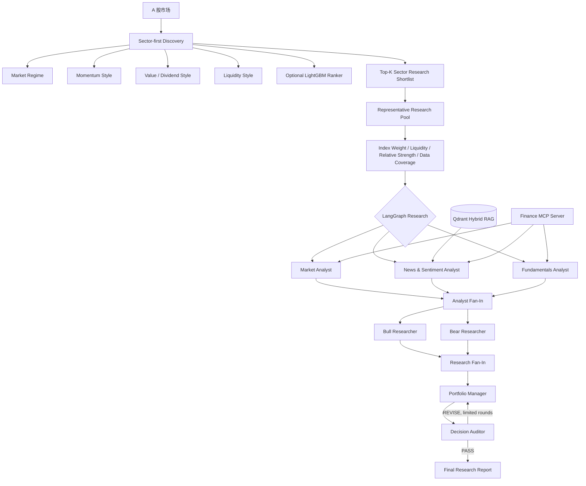

# A 股自动投研 Agent
### Multi-Agent A-Share Research & Candidate Discovery System

[](https://github.com/wyh22/multi-agent-trading/actions/workflows/ci.yml)


> 基于 [TauricResearch/TradingAgents](https://github.com/TauricResearch/TradingAgents) 二次开发的 A 股多智能体投研系统。  
> 项目聚焦 **行业发现 → 代表性个股研究 → 证据约束研判 → 独立审计 → 工程评测**，不执行自动交易，不构成投资建议。

## 30 秒看懂这个项目

传统 LLM 股票分析常见四类工程问题：**候选股票靠模型“猜”**、**历史研究混入未来数据**、**多 Agent 重复复述导致 Token/延迟膨胀**、**最终结论缺少独立校验**。

本项目针对这些问题做了系统化改造：

- 用确定性 Python 完成 **A 股行业发现与 Style Ranking**，Market Regime 只调整 Momentum / Value / Dividend / Liquidity 权重，不再通过 Top 行业硬门控个股；Top-K 行业之后再用行业权重、流动性、行业内相对强弱和数据完整性选择 Representative Research Entries；
- 用 **Point-in-Time（PIT）数据约束**限制历史时点可见信息，降低未来数据泄漏；
- 将原始多轮链路裁剪为 **7-Agent 并行 LangGraph**，分析师与 Bull/Bear 两阶段 Fan-Out/Fan-In；
- 在 Agent 之间引入 **Claim-aware Context Compression**：将证据显式区分为 FACT / CALCULATION / INFERENCE / CONDITIONAL，并按类型与字符预算选择性压缩；
- 增加 **Decision Auditor**，对最终结论做事实、数字、PIT 与证据一致性检查；
- 通过 **Finance MCP + Qdrant Hybrid RAG** 标准化工具与知识检索；
- 提供 **Agent Evaluation + Outcome Backtest**，把“工程质量”和“市场结果”分开评估；
- 提供 **FastAPI + 浏览器 Chat UI + Docker Compose**，支持本地服务化运行。

## 核心能力

| 模块 | 实现 | 解决的问题 |
| --- | --- | --- |
| 7-Agent LangGraph | Market / News / Fundamentals → Bull & Bear → Portfolio Manager → Auditor | 减少重复角色与无效多轮辩论 |
| 并行执行 | Analyst Subgraph + Fan-Out/Fan-In | 降低串行 Agent 延迟 |
| Claim-aware Context | FACT / CALCULATION / INFERENCE / CONDITIONAL + deterministic budget compression | 减少重复上下文，并防止推断/条件情景被升级为事实 |
| A 股行业发现 | Market Regime + Momentum/Value/Dividend/Liquidity Style Rank + 可选 LightGBM | 避免跨行业用同一套个股财务因子硬排名，并把数值排序交给可审计模型 |
| Representative Pool | 行业权重 + 流动性 + 行业内相对强弱 + 数据完整性 | 从 Top 行业选择 7-Agent 研究入口，不把研究路由伪装成投资评级 |
| PIT 数据治理 | 披露日/发布日期截止过滤 | 降低未来函数与历史穿越 |
| Decision Auditor | PASS / REVISE 条件路由 | 检查无依据推断和数字冲突 |
| Finance MCP | Streamable HTTP + Local fallback + allowlist | 解耦 Agent 与金融数据工具 |
| Hybrid RAG | Qdrant Dense + BM25 + RRF + 可选 Reranker | 为研究结论提供可追溯知识证据 |
| 多轮会话 | Router + thread_id + SQLite | 复用已审计研究上下文 |
| Agent Evaluation | Tool / PIT / Trajectory / Report Quality | 将 Agent 工程质量变成可回归指标 |
| Outcome Backtest | Rating vs. realized / benchmark return | 将“研究质量评估”和“市场结果评估”分离 |
| 服务化 | FastAPI / Chat UI / Docker Compose | 提升可复现性和演示效率 |
| 可观测性 | LangSmith Trace | 观察 LLM / Tool / Agent 调用链 |

## 系统架构



## 相比上游 TradingAgents，我做了什么

本仓库不是简单换数据源或改 Prompt，而是围绕 A 股投研场景重新做了一层工程化设计。

| 方向 | 上游框架基础 | 本仓库扩展 |
| --- | --- | --- |
| 研究对象 | 通用单股研究 | A 股数据适配 + 候选发现 |
| Agent 拓扑 | 多角色、多轮讨论 | 精简为 7-Agent，两阶段并行 |
| 行业发现 | 不是主要目标 | 全量申万一级行业横截面 + Regime-aware Style Rank + 可选 LightGBM；旧股票筛选保留为 legacy 对照 |
| 历史研究 | 依赖数据源行为 | 显式 PIT 截止规则与日期守卫 |
| 最终决策 | 研究链路汇总 | 独立 Decision Auditor，可触发修订 |
| 工具集成 | 本地工具为主 | MCP Server + Client fallback + 外部工具 allowlist |
| 知识检索 | 非核心 | Qdrant Dense + BM25 + RRF + PIT filter |
| 交互 | CLI 为主 | 多轮 Conversation Router + SQLite + Web Chat |
| 评估 | 以功能验证为主 | Agent Evaluation + Outcome Backtest |
| 部署 | 本地执行 | FastAPI + Docker Compose |
| 验证 | 上游测试 | Agent / RAG / MCP / PIT / Conversation / Evaluation 回归测试 |

详细设计见 [docs/ENGINEERING_NOTES.md](docs/ENGINEERING_NOTES.md)。

## 快速开始

### 1. 本地 Python

推荐 Python 3.11 / 3.12。

```bash
git clone https://github.com/wyh22/multi-agent-trading.git
cd multi-agent-trading

python -m venv .venv
source .venv/bin/activate   # Windows: .venv\Scripts\activate

python -m pip install --upgrade pip
pip install -e ".[agent,dev]"

cp .env.example .env
```

至少配置一个可用 LLM Provider 的 API Key。MCP、RAG、LangSmith 能力均可按需开启。

### 2. 数据源预检

```bash
python scripts/check_data_sources.py --ticker 601016
```

### 3. A 股行业发现

```bash
python scripts/discover_a_share.py \
  --mode all \
  --date 2026-08-20 \
  --top 6
```

### 4. 行业发现 Agent Demo

```bash
python scripts/discovery_agent_demo.py --date 2026-08-20
```

### 5. 生成 Representative Research Pool

```bash
python scripts/discover_a_share.py \
  --mode pool \
  --date 2026-09-05 \
  --top 4 \
  --representatives-per-sector 2
```

这一层只选择“适合进入深度研究”的行业代表股，不输出买入评级。严格 PIT 模式下，历史日期若无法恢复当时真实申万成分，会主动拒绝，避免幸存者偏差。

可直接从生成的 Research Pool 携带来源上下文进入 7-Agent：

```bash
python scripts/analyze_representative.py \
  --pool-csv reports/.../representative_research_pool.csv \
  --ticker 600000.SH \
  --date 2026-09-05
```

### 6. 单股深度研究

```bash
python -m cli.main analyze
```

### 7. FastAPI / Chat UI

```bash
uvicorn service.app:app --host 0.0.0.0 --port 8000
```

启动后：

- API 健康检查：`http://localhost:8000/health`
- Swagger：`http://localhost:8000/docs`
- 浏览器 Chat UI：`http://localhost:8000/ui/`

### 8. Docker Compose

```bash
cp .env.example .env
# 编辑 .env，填入真实的 LLM API Key
docker compose up --build
```

Compose 会启动：

- `agent-api:8000`
- `finance-mcp:8001`
- `qdrant:6333`

## API 示例

### 健康检查

```bash
curl http://localhost:8000/health
```

### 候选发现

```bash
curl -X POST http://localhost:8000/discover \
  -H "Content-Type: application/json" \
  -d '{
    "as_of_date": "2026-08-20",
    "top_n": 6
  }'
```

### Representative Research Pool API

```bash
curl -X POST http://localhost:8000/research-pool \
  -H "Content-Type: application/json" \
  -d '{
    "as_of_date": "2026-09-05",
    "sector_top_n": 4,
    "representatives_per_sector": 2,
    "component_limit": 20,
    "strict_pit": true
  }'
```

返回的每个代表股包含 `research_context`。如果随后通过 `POST /analyze` 研究该 ticker，可将其作为 `candidate_context` 传入。7-Agent 会知道研究来源，但 Prompt 与 Auditor 都明确规定该来源只是 selection prior，不能作为投资证据。

### 多轮研究会话

```bash
curl -X POST http://localhost:8000/chat \
  -H "Content-Type: application/json" \
  -d '{
    "message": "深度分析 600519.SH，然后告诉我最大的风险是什么",
    "mode": "auto"
  }'
```

## 项目结构

```text
multi-agent-trading/
├── tradingagents/
│   ├── agents/          # Analysts / Researchers / Manager / Auditor
│   ├── graph/           # LangGraph、Subgraph、Fan-In/Fan-Out
│   ├── discovery/       # 行业发现、Style Rank、Representative Pool、可选 LightGBM、legacy 股票筛选
│   ├── conversation/    # 多轮会话路由与状态
│   ├── mcp/             # Finance MCP Server / adapters
│   ├── rag/             # Qdrant Hybrid RAG
│   ├── evaluation/      # Agent 轨迹、PIT、工具调用与报告质量评测
│   ├── backtest/        # 评级与实际/基准收益结果评估
│   └── dataflows/       # 行情、财务、公告、宏观等数据适配
├── evaluation/datasets/ # Agent Evaluation 样例数据集
├── examples/            # RAG 等可复现实例数据
├── service/             # FastAPI + Web Chat UI
├── scripts/             # 数据预检、候选发现、RAG ingest、Demo、Chat CLI
├── tests/               # 回归测试
├── docs/                # 工程设计说明
├── Dockerfile
├── docker-compose.yml
└── pyproject.toml
```

## 验证与可复现性

测试数量会随功能演进变化，因此 README 不再把历史的固定 `passed` 数量当作当前质量指标。详见 [V1.4_VALIDATION.md](V1.4_VALIDATION.md) 与 GitHub Actions；当前 CI 持续验证 Python 3.11/3.12、依赖一致性、Compile、Import Smoke、Pytest 与 Docker Build。

CI 在 Push / Pull Request 上执行：

```bash
python -m compileall -q tradingagents service scripts
python -c "from service.app import app; assert app.title"
pytest -q
docker build .
```

> 离线单元/回归测试通过，不等价于所有第三方在线服务已完成生产验证。真实 LLM、外部 MCP 与实时数据源仍依赖本地凭据与网络环境。

## Sector-first Discovery V2

默认 Discovery 不再输出“全市场最好的 Top10 股票”，而是输出 **Top-K 行业研究优先级**。行业评分拆为四个可解释 Style：

- **Momentum**：1/20/60 日相对动量；
- **Value**：PE/PB 横截面便宜度；
- **Dividend**：行业股息率横截面排名；
- **Liquidity**：换手率 + 成交额占比。

Market Regime 只调整 Style 权重，不再决定哪些行业/股票有资格参加后续筛选。这样科技成长板块可以依靠 Momentum 获胜，高股息板块可以依靠 Dividend 获胜，避免“所有股票参加同一套财务考试”。

可选安装 LightGBM：

```bash
pip install -e ".[quant]"
python scripts/discover_a_share.py --mode all --date 2026-09-05 --top 6 --ml-model ./models/sector_ranker.txt --ml-weight 0.5
```

仓库**不内置宣称有效的预训练量化模型**。ML 模型需要使用时间切分 / Walk-forward 验证后自行提供；推理时模型分数会先转成同日横截面百分位，再与 Rule Score 融合。旧版股票筛选保留为：

```bash
python scripts/discover_a_share.py --mode legacy-stock --date 2026-09-05 --top 10
```

### Representative Research Pool 为什么不是第二套选股模型

Top-K 行业之后，每个行业只选少量代表性股票作为 7-Agent 的 Research Entry。评分刻意限定为：

```text
35% 申万行业指数权重
30% 20日平均成交额
20% 行业内20/60日相对强弱
15% 数据完整性
```

这里**不使用 PE/PB、ROE、净利润增长或 Quality Score**。原因是这一层只负责“研究谁”，不负责“买谁”。每个代表股会生成 `research_context`，并以 `candidate_context` 进入 LangGraph；所有 Agent 都被要求把它当作 selection prior，而不是事实证据，Auditor 还会检查是否出现先验被升级成投资事实的情况。

## 关键工程设计

### 为什么 Discovery 改成行业优先

旧版 `Top Sector → Stock Quant → Quality → Top10` 容易产生 Sector-first hard gating：行业在前面被淘汰后，再优秀的成长股、高股息股也没有机会进入后续研究；同时 Sector Score 又在个股评分里重复使用，形成双重行业偏置。V2 把行业本身定义为 Discovery 的主输出，个股回到“代表性研究入口”角色。

### 为什么“筛选”不用 LLM

因子计算、日期判断、排序和配额属于确定性任务。让 LLM 直接负责这些环节既难验证，也容易产生幻觉。因此本项目把：

- 数值计算；
- PIT 日期守卫；
- 股票排序；
- 行业配额；
- 数据有效性检查；

尽量交给 Python。LLM 主要负责语义分析、工具选择、观点综合与审计。

### 为什么要区分四类 Claim

Analyst 最终报告追加紧凑的 `Evidence Claims` 接口，并将声明区分为：

- `FACT`：可直接由 Tool / 检索数据支持；
- `CALCULATION`：基于已知输入得到的派生计算；
- `INFERENCE`：从证据形成的解释性判断；
- `CONDITIONAL`：只有触发条件成立时才有效的未来情景。

Context Compression 优先解析显式标签；旧报告没有标签时使用确定性规则兜底。压缩阶段优先保留事实、计算和 Claim 类型多样性，不额外调用 LLM。Bull/Bear、Portfolio Manager 与 Auditor 都会收到类型语义约束，避免把推断或条件性预测重述为既成事实。

### 为什么增加 Auditor

Portfolio Manager 负责形成最终观点，本身不适合作为自己的校验器。独立 Auditor 只检查：

- 事实与数字是否有上游证据；
- 是否出现截止日后的信息；
- 推断是否被写成事实；
- 评级是否与证据方向冲突；
- 是否存在前后数字不一致。

若发现实质问题，可通过 LangGraph 条件边触发有限次数修订。

### 为什么单独做 Agent Evaluation

股票涨跌不能直接回答“Agent 工程是否可靠”。因此项目把两类评估拆开：

- **Agent Evaluation**：工具是否选对、参数日期是否越界、轨迹是否符合预期、最终报告数字是否能在上游证据中找到；
- **Outcome Backtest**：历史研究评级之后的实际收益、相对基准收益、方向命中率、回撤和 Sharpe。

这样可以避免把偶然的市场结果误当成 Agent 架构质量，也避免只看单元测试而忽略最终输出。

### 为什么要做 PIT-aware RAG

普通 RAG 只关注“相关不相关”，历史投研还必须回答“当时能不能看到”。因此检索同时约束：

```text
ticker == target
publish_date <= as_of_date
```

并在向量检索之后再次做日期防御性检查。

## 数据源边界

| 数据类型 | 默认来源 | 设计原则 |
| --- | --- | --- |
| A 股 OHLCV / 估值 | BaoStock | 截止研究日读取，避免未来数据 |
| 财务报表 | AKShare / 新浪财经 | 按可用更新日期做 PIT 过滤 |
| 正式公告 | 巨潮资讯（CNInfo） | 公告时间不晚于研究截止日 |
| 中国宏观 | AKShare 公共接口 | 结合统计期和发布滞后做可用日判断 |
| 全球市场资讯 | AKShare / 财联社 | 只保留截止日前可见内容 |
| 可选扩展 | Alpha Vantage / FRED | 不作为 A 股核心链路的必要依赖 |

## 数据与安全边界

- 公开仓库不包含 `.env`、API Key 或 LangSmith Key。
- 默认 A 股数据链路以 BaoStock、AKShare、巨潮资讯为主；Alpha Vantage 与 FRED 仅保留为可选扩展。
- 默认行业发现不依赖当前股票成分股恢复；旧版 legacy-stock 模式仍可能受到历史成分数据完整性和幸存者偏差影响。
- 行业发现结果是 Sector Research Shortlist，不是个股买入清单或收益承诺。
- 本项目不执行自动下单，不提供真实资金交易接口。

## 文档

- [SECTOR_DISCOVERY.md](docs/SECTOR_DISCOVERY.md)：Sector-first Style Rank、Regime 权重、可选 LightGBM 与 legacy 对照
- [INTERVIEW_GUIDE.md](docs/INTERVIEW_GUIDE.md)：90 秒项目介绍、各 Agent/Prompt/Tool 具体实现、深挖问题与面试答案
- [PROJECT_WALKTHROUGH.md](docs/PROJECT_WALKTHROUGH.md)：从一次真实请求出发梳理行业发现、7-Agent、PIT、MCP/RAG、评测与服务化执行链路
- [ENGINEERING_NOTES.md](docs/ENGINEERING_NOTES.md)：设计取舍、代码所有权边界、面向工程评审的实现说明
- [FINAL_ARCHITECTURE.md](FINAL_ARCHITECTURE.md)：7-Agent、Subgraph、Fan-Out/Fan-In、Auditor
- [MCP_RAG_DOCKER_GUIDE.md](MCP_RAG_DOCKER_GUIDE.md)：MCP、Qdrant Hybrid RAG、Docker
- [V1.4_VALIDATION.md](V1.4_VALIDATION.md)：当前离线验证边界

## 二次开发与许可证

本项目基于 [TauricResearch/TradingAgents](https://github.com/TauricResearch/TradingAgents) 二次开发。原项目采用 Apache License 2.0，本仓库保留原许可证，并在 [NOTICE](NOTICE) 中说明原始作者与二次开发范围。

如果只阅读 15 分钟，建议优先看：

1. `tradingagents/graph/setup.py`
2. `tradingagents/discovery/`
3. `tradingagents/agents/auditors/decision_auditor.py`
4. `tradingagents/mcp/`
5. `tradingagents/rag/`
6. `tradingagents/conversation/`
7. `tradingagents/evaluation/`
8. `tradingagents/backtest/`
9. `service/app.py`

---

**Research system, not an auto-trading bot. Evidence first, deterministic where possible, auditable by design.**
